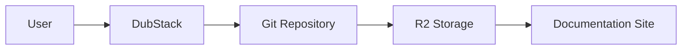

DubStack supports various ways to embed images, videos, and other media in your documentation.

## Images

### Using Markdown syntax

The standard [Markdown syntax](https://www.markdownguide.org/basic-syntax/#images) for images:

```markdown

```

<Callout type="info">
Image files should be placed in the `/images` directory at the root of your repository.
</Callout>

### Using HTML img tags

For more control over image display:

```html

```

### Image optimization

DubStack automatically optimizes images for faster loading:

- Automatic format conversion (WebP support)
- Responsive sizing
- Lazy loading
- CDN delivery

<Callout type="warning">
Keep image file sizes under 5MB for best performance. For larger files, use an image hosting service like [Cloudinary](https://cloudinary.com/) or [Cloudflare Images](https://www.cloudflare.com/products/cloudflare-images/).
</Callout>

## Image captions

Add captions to provide context:

<Frame caption="The DubStack Theme Studio lets you customize colors and fonts visually">
  
</Frame>

```mdx
<Frame caption="The DubStack Theme Studio lets you customize colors and fonts visually">
  
</Frame>
```

## Dark mode images

Show different images for light and dark mode:

```html
<picture>
  <source srcset="/images/hero-dark.png" media="(prefers-color-scheme: dark)" />
  
</picture>
```

## Videos

### YouTube embeds

Embed YouTube videos using iframes:

<iframe
  width="100%"
  height="400"
  src="https://www.youtube.com/embed/dQw4w9WgXcQ"
  title="YouTube video player"
  frameBorder="0"
  allow="accelerometer; autoplay; clipboard-write; encrypted-media; gyroscope; picture-in-picture"
  allowFullScreen
  style={{ borderRadius: '0.5rem' }}
></iframe>

```html
<iframe
  width="100%"
  height="400"
  src="https://www.youtube.com/embed/VIDEO_ID"
  title="YouTube video player"
  frameBorder="0"
  allow="accelerometer; autoplay; clipboard-write; encrypted-media; gyroscope; picture-in-picture"
  allowFullScreen
  style={{ borderRadius: '0.5rem' }}
></iframe>
```

### Self-hosted videos

Use the HTML5 video element for self-hosted videos:

```html
<video
  controls
  width="100%"
  style={{ borderRadius: '0.5rem' }}
>
  <source src="/videos/demo.mp4" type="video/mp4" />
  Your browser does not support the video tag.
</video>
```

<Callout type="tip">
Host large video files on a CDN or video platform like YouTube, Vimeo, or Cloudflare Stream for better performance.
</Callout>

## GIFs and animations

Animated GIFs work the same as regular images:

```markdown

```

<Callout type="warning">
Animated GIFs can be large. Consider using video formats (MP4, WebM) for better compression and quality.
</Callout>

## Icons

DubStack uses [Lucide icons](https://lucide.dev) throughout the platform. Reference them by name in components:

```mdx
<Card title="Documentation" icon="book" href="/docs">
  Browse the complete documentation
</Card>
```

Common icons:
- `book` - Documentation
- `rocket` - Quick start
- `code` - Code examples
- `sparkles` - AI features
- `palette` - Themes
- `settings` - Configuration
- `shield` - Security
- `zap` - Performance

## Diagrams

### Mermaid diagrams

DubStack supports Mermaid for creating diagrams:



````markdown

````

### SVG diagrams

Embed SVG diagrams directly:

```html
<svg width="400" height="200" xmlns="http://www.w3.org/2000/svg">
  <rect x="10" y="10" width="180" height="80" fill="#3b82f6" />
  <text x="100" y="55" text-anchor="middle" fill="white">DubStack</text>
</svg>
```

## File size best practices

<Steps>
  <Step title="Compress images">
    Use tools like [TinyPNG](https://tinypng.com/) or [Squoosh](https://squoosh.app/) to reduce file sizes without losing quality.
  </Step>

  <Step title="Choose the right format">
    - **Photos**: JPEG or WebP
    - **Graphics with transparency**: PNG or WebP
    - **Simple graphics**: SVG
    - **Animations**: MP4 video instead of GIF
  </Step>

  <Step title="Optimize dimensions">
    Don't upload images larger than they'll be displayed. Most documentation images don't need to be wider than 1200px.
  </Step>
</Steps>

## Accessibility

Always include descriptive alt text for images:

```markdown

```

<Callout type="success">
Good alt text describes what's in the image and why it matters to the documentation.
</Callout>

## Next steps

<CardGroup cols={2}>
  <Card title="Navigation" icon="map" href="/essentials/navigation">
    Configure your site navigation
  </Card>
  <Card title="Reusable snippets" icon="recycle" href="/essentials/reusable-snippets">
    Create reusable content
  </Card>
</CardGroup>
